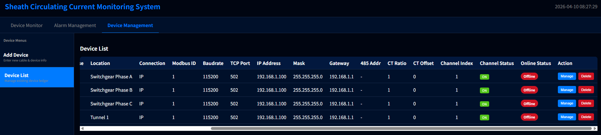

# ⚡ Cable Sheath Circulating Current Online Monitoring System - Product Manual

## I. Product Overview

**Cable Sheath Circulating Current Online Monitoring System** is a modern Web monitoring and management platform specifically built for the operational status of high-voltage cables. Built upon the high-performance Plotly Dash framework, this system integrates three core business modules: data visualization, alarm management, and device ledger management.

    
    
🖼️ <b>Figure 1: System Real-time Monitoring Dashboard</b>

The system can intuitively present the real-time current dynamics of cable channels, accurately capture harmonic distortion, and provide intelligent AI diagnostic suggestions when anomalies occur. It is a powerful tool for power operation and maintenance teams to achieve digital management of cables.

---

## II. Core Features

### 1. 📡 Real-time Panoramic Monitoring (Device Monitor)

The system provides a real-time monitoring panel with millisecond-level response:
*   **Dynamic Waveform Tracking**: Real-time plotting of the current waveform of the cable channel, automatically extracting and displaying the Peak, Valley, and RMS values.
*   **In-depth Harmonic Analysis**: Dynamically generates harmonic analysis bar charts, intuitively displaying the 1st, 2nd, 3rd, 5th, and 7th harmonic components and the Total Harmonic Distortion (THD).
*   **Limit Exceeding Visual Warning**: When monitoring data exceeds the safety threshold, the relevant numerical panels and waveform markers will immediately trigger an eye-catching red flashing animation, ensuring that maintenance personnel notice the anomaly at the first possible moment.

    
    
🖼️ <b>Figure 2: Alarm Status</b>

### 2. 🚨 Intelligent Alarm Management

Provides full-process alarm services from rule formulation to closed-loop processing:

#### 2.1 📜 Alarm List and AI Diagnosis (Alarm List)

*   **Real-time Event Traceability**: Exhaustively records all limit-exceeding events, including the precise time of occurrence, associated device, specific alarm item, and extreme value of the exceedance.
*   **🧠 AI Diagnostic Assistant**: An industry-first one-click AI analysis function. For a single alarm record, the AI engine can quickly generate a diagnostic report, providing highly practical troubleshooting suggestions such as "Check grounding loop" and "Troubleshoot sensor wiring".

    
    
🖼️ <b>Figure 2: Alarm List and Expanded AI Diagnostic Report</b>

#### 2.2 🎛️ Upper and Lower Threshold Management (Alarm Config)

*   **Fine-grained Threshold Configuration**: Supports independent setting of upper and lower limits for RMS, peak/valley current, phase offset, zero-crossing offset, and various harmonics. Once the configuration is saved, the rules immediately take effect in the global monitoring engine.

    
    
🖼️ <b>Figure 3: Upper and Lower Threshold Management Page</b>

### 3. ⚙️ Digital Device Ledger (Device Management)

Say goodbye to paper and Excel records and achieve cloud-based management of asset status:

#### 3.1 📋 Device List and Status Monitoring (Device List)

*   **Global Asset Overview**: View the list of all registered collector devices at a glance, quickly grasping the **Channel Status** and **Online Status** of each device.
*   **Convenient O&M Operations**: Perform quick editing or one-click deletion of devices in the list to achieve closed-loop management.

    
    
🖼️ <b>Figure 4: Device List and Status Overview Page</b>

#### 3.2 ➕ Asset Registration and Parameter Configuration (Add Device)

*   **Detailed Asset Archives**: Supports the registration of key physical information such as cable model, length, laying method, affiliated tunnel, and phase.
*   **Communication and Hardware Configuration**: Deeply adapts to underlying hardware, supports configuring network parameters such as IP/RS-485 mode, Modbus slave address, baud rate, and TCP port, and allows flexible adjustment of the enable status and CT ratio/offset of each channel.

    
    
🖼️ <b>Figure 5: Add Device and Configuration Form Page</b>

---

## III. System Architecture and Technical Advantages

1.  **Modern Web Architecture**: Driven by Python on the backend and rendered using Plotly Dash on the frontend. No need to install bulky clients; the system can be accessed anytime, anywhere via a standard browser.
2.  **Software and Hardware Decoupling Design**: The system natively supports the logical model of the industry-standard Modbus protocol. A high-fidelity simulated data engine is built-in during the demonstration phase, enabling the verification of all business processes and alarm mechanisms without relying on physical hardware.
3.  **Responsive UI and Smooth Interaction**: The interface utilizes global CSS animation and hot-reloading technologies. Data refresh is smooth without stuttering, providing an excellent user experience.
4.  **Cloud-based Online Experience**: To facilitate your quick assessment of system functionalities, we provide an out-of-the-box online demonstration environment. No tedious local deployment is required; please access it directly using a browser: [http://138.2.54.115:8050/](http://138.2.54.115:8050/)

*(Note: The current demo version runs in a pure stateless mode, focusing on the demonstration and verification of core business flows. Historical data persistence and storage functions will be smoothly upgraded and integrated in subsequent commercial versions.)*