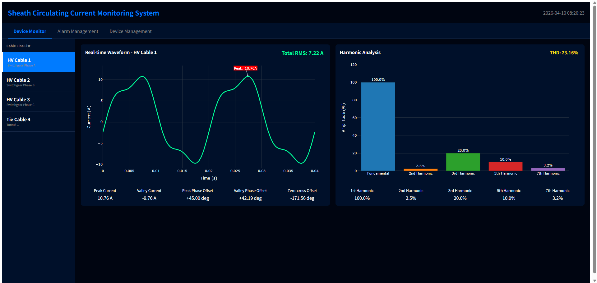
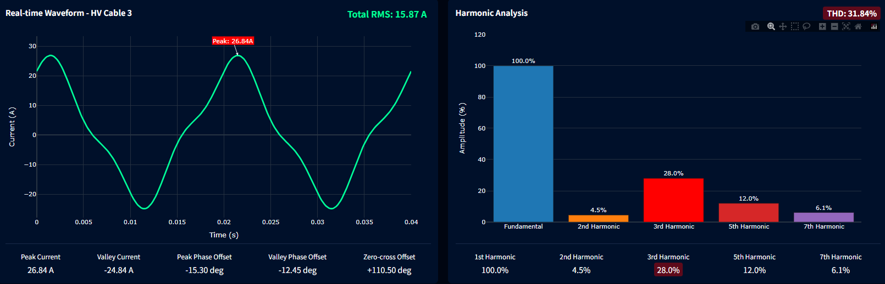
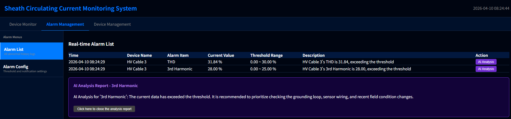
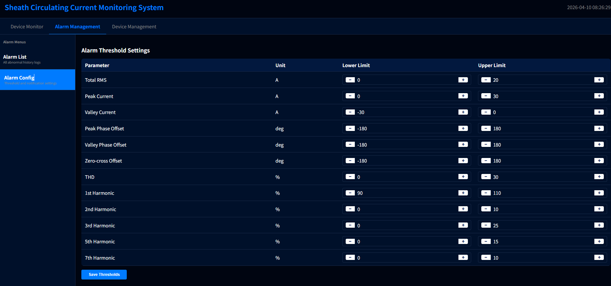
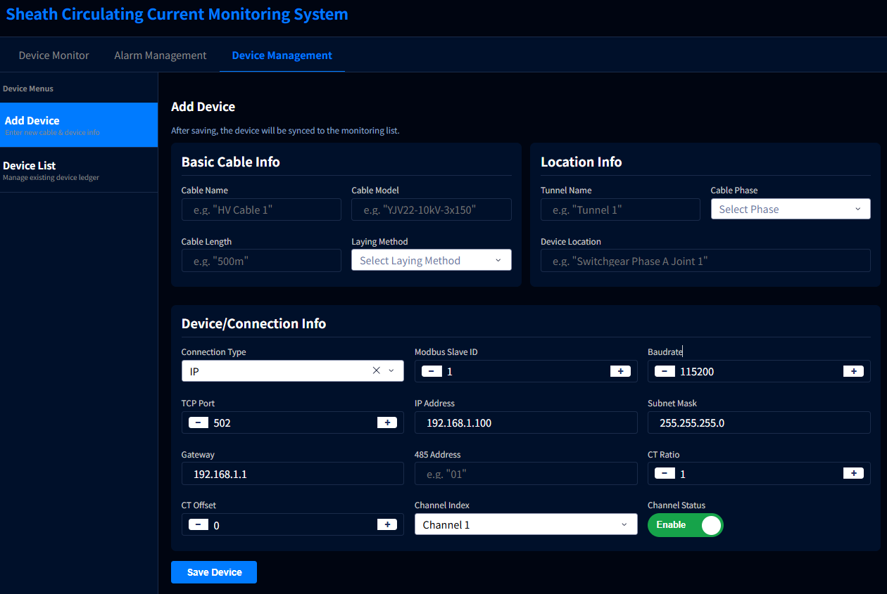

# 📖 Cable Sheath Circulating Current Online Monitoring System - User Manual

## I. Preface

Welcome to the **Cable Sheath Circulating Current Online Monitoring System (Web Console)**! This system is designed specifically for real-time monitoring, alarm troubleshooting, and device scheduling of power assets. Through this manual, you will quickly master the core operations of the system and easily manage your cable network.

## II. Quick Start and Access

**Method 1: Cloud-based Online Experience (Recommended)**
No local deployment is required; we provide an out-of-the-box online demonstration environment. Please directly open your browser and access: http://138.2.54.115:8050/ to quickly experience the full system.

**Method 2: Local Deployment and Execution**
If you need to test locally, please ensure your computer has Python 3 and the required dependencies (`dash`, `plotly`, `numpy`) installed.
1. Open a command-line terminal and enter the project directory `2_Python_Companion`.
2. Execute the startup command: `python circulating_current.py`
3. Once the terminal prompts that the service is running, open your browser and access: `http://127.0.0.1:8050` to enter the system main console.

    
    
🖼️ <b>Figure 1: System Login or Homepage Overview</b>

---

## III. Core Module Operation Guide

### 3.1 📡 Real-time Monitoring (Device Monitor)

After the system starts, it defaults to the real-time monitoring view, which is your primary window to grasp field dynamics.

1.  **Switch Monitoring Target**: Select different cable lines (e.g., HV Cable 1, HV Cable 2) in the left sidebar (or dropdown menu), and the main panel will immediately switch to the real-time data of the corresponding channel.
2.  **View Waveform and Metrics**: Observe the real-time current waveform chart in the middle. The current peak, valley, and root mean square (RMS) values will be dynamically updated above the chart.
3.  **Harmonic Analysis**: View the bar chart on the right or below to understand the distribution of the 1st to 7th harmonics and the Total Harmonic Distortion (THD).
4.  **🚨 Identify Alarms**: Pay close attention to the values on the interface. If a metric (such as RMS or a specific harmonic) exceeds the preset safety range, the background of that metric will **flash red**, prompting you that an anomaly currently exists.

    
    
🖼️ <b>Figure 2: Real-time Monitoring Panel (including red flashing alarm status)</b>

### 3.2 🚨 Alarm Management and AI Diagnosis (Alarm Management)

When a limit-exceeding flash occurs during real-time monitoring, the system has automatically recorded the event.

Click **"Alarm Management"** in the top navigation bar to enter this module.

#### 3.2.1 📜 Alarm Event Traceability and AI Diagnosis (Alarm List)

1.  **View Alarm List**: Select the "Alarm List" menu on the left, and you will see all limit-exceeding events sorted in reverse chronological order, including device name, limit-exceeding type, and specific values.
2.  **🤖 Get AI Diagnosis**: Click the **"AI Analysis"** button next to any alarm record. The system will expand a detailed diagnostic report panel, providing expert-level troubleshooting suggestions.

    
    
🖼️ <b>Figure 3: Alarm List and Expanded AI Diagnostic Report</b>

#### 3.2.2 🎛️ Upper and Lower Threshold Management (Alarm Config)

This page allows you to customize exclusive safety boundaries for cables in different environments. The operating steps are as follows:

1.  **Select Configuration Item**: Click "Alarm Config" in the left menu. The page lists all monitoring metrics by category (e.g., Total RMS, specific harmonics, etc.).
2.  **Set Threshold Range**: In the corresponding **Upper Limit** and **Lower Limit** input boxes, enter the safe values suitable for your site environment. For example, set the upper limit of the 3rd harmonic to `25.00`.
3.  **Save and Apply Rules**: After modifying the input box values and clicking save, **the new alarm rules will immediately take effect in the global backend**. Once the real-time monitoring data breaks through the range you just set, the system will immediately trigger a red flashing alarm.

    
    
🖼️ <b>Figure 4: Upper and Lower Threshold Management Interface</b>

### 3.3 ⚙️ Device Ledger Management (Device Management)

Standardized asset management is the premise of accurate monitoring. Click **"Device Management"** in the top navigation bar to enter the module.

#### 3.3.1 📋 Device List and Status Monitoring (Device List)

Select the "Device List" menu on the left, which provides a global view of all collector assets:
1.  **Core Status Overview**: The list intuitively displays the **Channel Status** (Enable/Disable) and **Online Status** (Offline/Online) of each device, facilitating quick inventory.
2.  **Quick Edit and Management (Action)**: In the action column on the far right, you can perform closed-loop management of the existing ledger.
    *   Click **Edit**: The system will populate the form with the device's parameters. You can quickly modify its IP address or baud rate, and just save it after modification.
    *   Click **Delete**: You can completely remove the ledger of collectors that have been retired or are no longer monitored.

    
    
🖼️ <b>Figure 5: Device List and Status Management Interface</b>

#### 3.3.2 ➕ Register and Configure New Device (Add Device)

Select the "Add Device" menu on the left to complete the creation of a new collector profile:

1.  **Basic and Location Information**: Fill in the Cable Name, Model, length, and laying method; and complete the tunnel name and specific Cable Phase on the right.
2.  **Communication Parameter Configuration (Device/Connection Info)**:
    *   Select **Connection Type**: Choose IP or RS485 based on on-site hardware.
    *   Configure Network and Modbus: Accurately fill in the IP Address, TCP Port (e.g., 502), Modbus Slave ID, and Baudrate, etc.
3.  **Hardware Calibration and Enabling**: Select the corresponding Channel Index, fill in the **CT Ratio** and Offset according to the on-site sensor, and finally toggle the switch to ensure the **Channel Status** is `Enable`.
4.  **Save Profile**: After verifying that there are no errors, click **"Save Device"**. The newly created device will immediately synchronize and appear in the "Device List" and the sidebar of "Real-time Monitoring".

    
    
🖼️ <b>Figure 6: Add Device Form Interface</b>

---

## IV. ⚠️ Important Notes for Current Version

To let you better experience this demonstration system, please note the following operating mechanisms:

1.  **Simulated Operating Mode**: The current system is not yet directly connected to a physical data collector. All waveforms, values, and alarms triggered by exceeding limits that you see on the interface are test data generated by the system's built-in **high-fidelity simulation engine**. This allows you to fully experience the various management and control functions of the system without hardware.
2.  **Data Status Reset**: Please note that this demonstration program is designed to be lightweight and **has not yet been connected to an external database**. This means that all modifications you make in the system (e.g., newly created device ledgers, adjusted alarm thresholds, generated alarm histories, etc.) are saved in memory. **Once you refresh the browser page or restart the terminal service, all data will revert to the system's initial default state.**

This project is developed by a personal team. If you have deep customization needs, functional suggestions, or need to connect to real hardware sensor data sources, please feel free to contact the developers for technical exchange and cooperation.